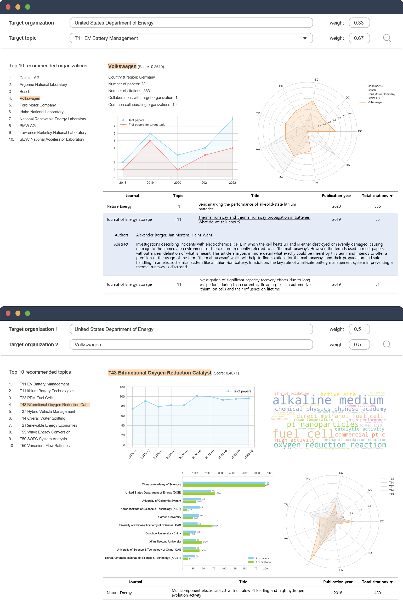

<h1 align="left">NEON protocol</h1>

## Implementation of "NEON as a navigator of energy open innovation ecosystems"
This is an official source code for implementing NEON.
***
### Protocol structure
1) Data collection and preprocessing
2) Energy-specific topic detection
3) Energy open innovation network construction
4) Research collaboration opportunity identification

### Dataset
- data/bertopic_document_embeddings.pkl: the embedding vectors for documents in Period 1.
- data/bertopic_get_document_info.pkl: the topic information for documents in Preiod 1.
- data/betropic_topics_for_p2.pkl: inferred topics for the documents in Period 2.
- data/entities_DeepWalk.pkl: the embedding vectors for nodes in Period 2.
- data/processed_data.csv: the processed data for topic-paper-organization-nation links.
- data/sample_papers.xlsx: the sample data collected from the Web of Science.
- data/topic_labels.xlsx: the labels and abbreviations of research topics.

### Code
- src/data_preprocessing.ipynb: source code for data preprocessing, disambiguating the nationality of organizations, and preparing the topic-paper-organization-nation link data.
- src/network_construction.ipynb: source code for modeling the energy open innovation network.
- src/triplet_recommendation.ipynb: source code for recommending collaboration opportunities and drawing figures for the collaboration recommendation system.

### Collaboration Recommendation System
The following images illustrate the design concept for the interactive web service of the collaboration recommendation system implementing our protocol.



### Citation
If you find the codes useful, please cite our paper:

```
title = "NEON as a navigator of energy open innovation ecosystems",
authors = Jeamin Chung, Janghyeok Yoon, Jaewoong Choi,
journal = "",
year = ,
doi = ""
```
